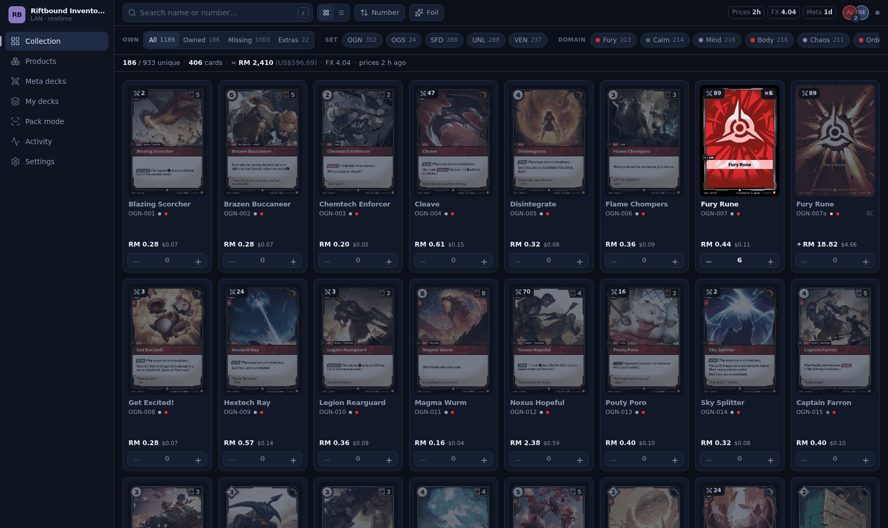
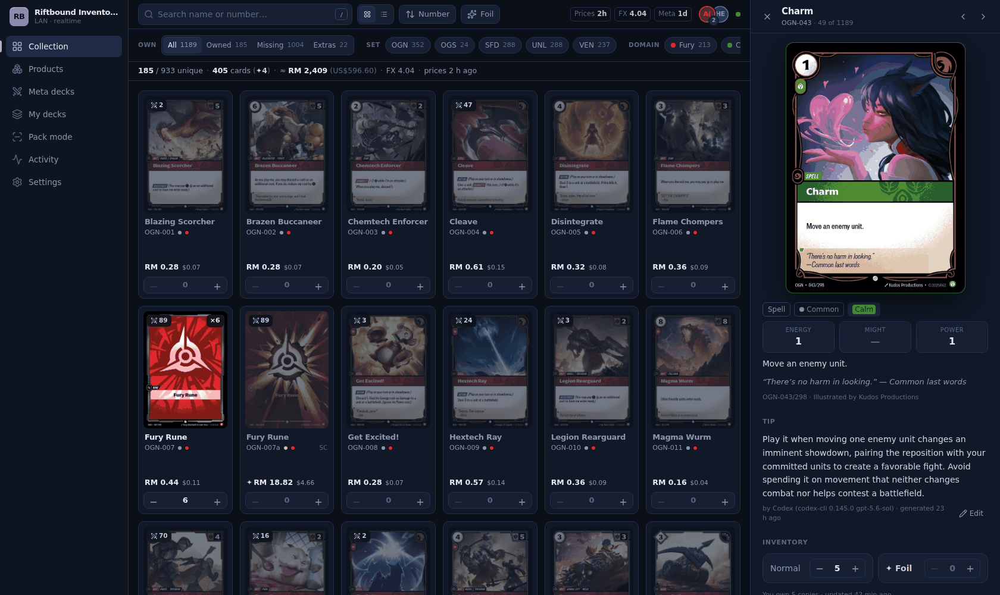
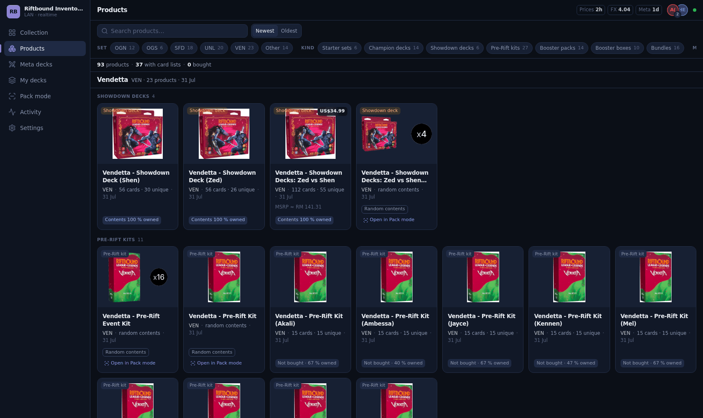
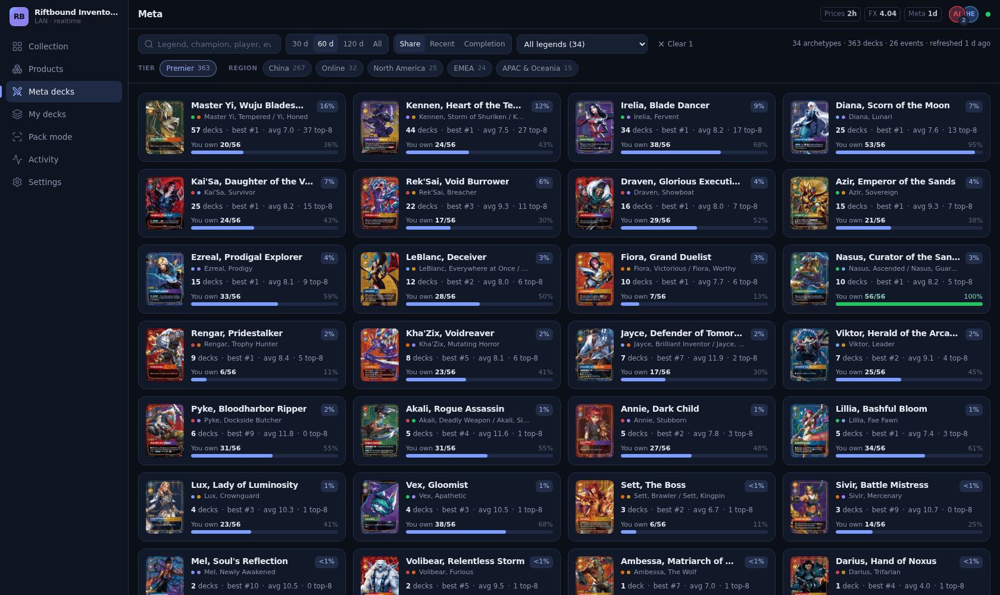
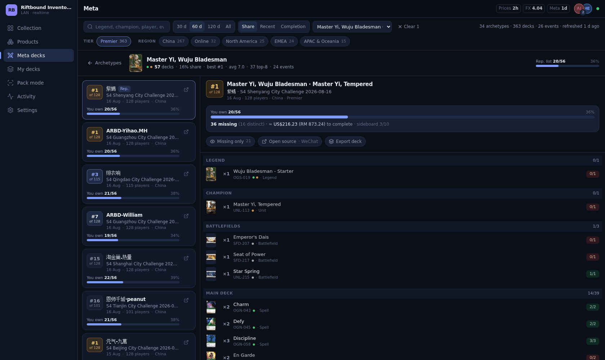
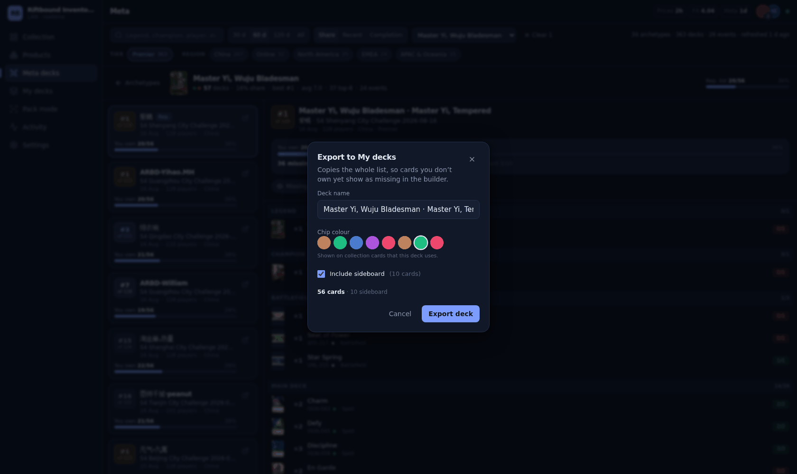
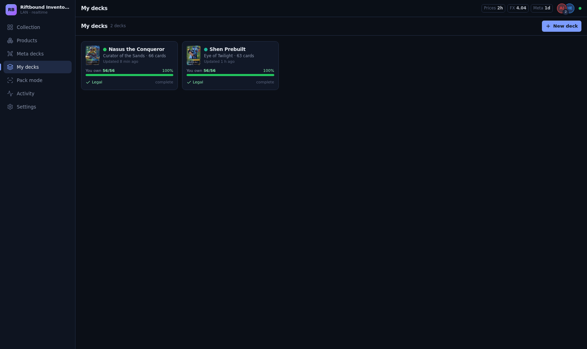
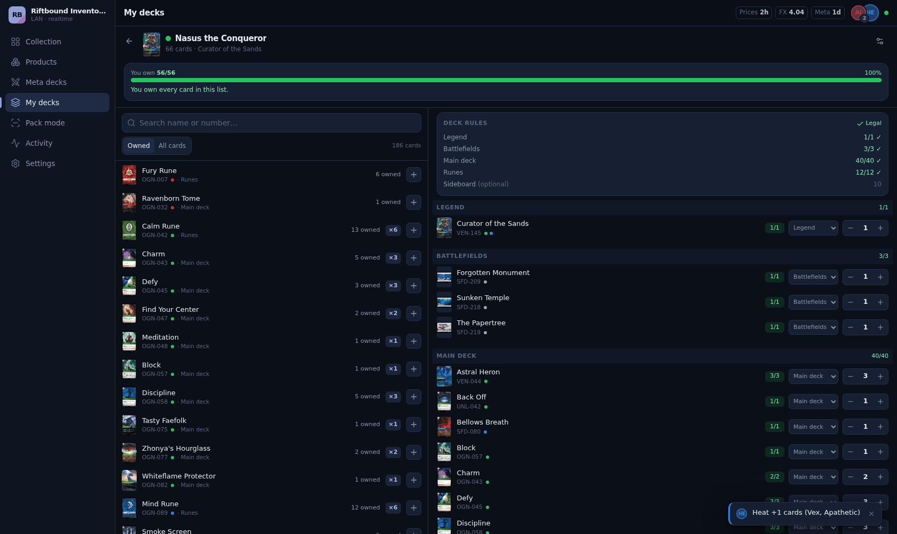
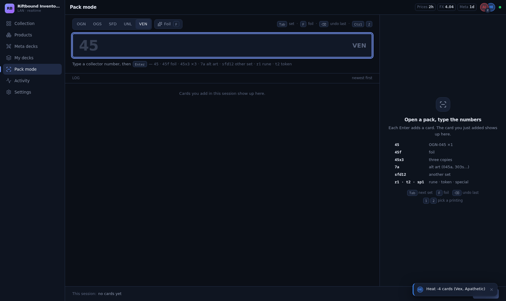
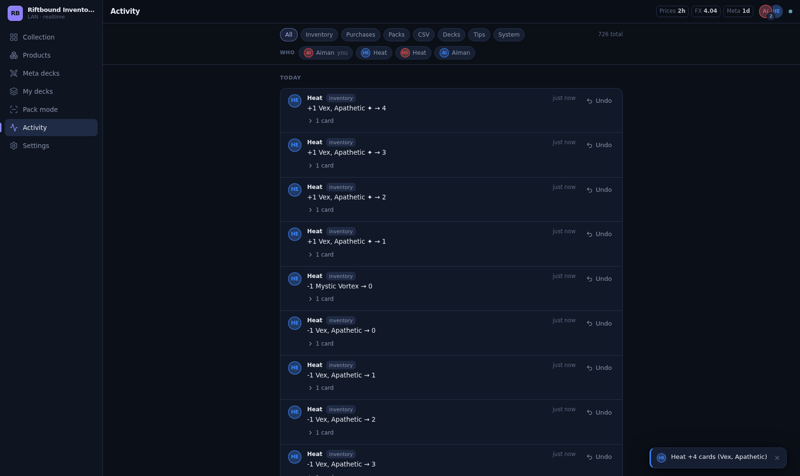

# Riftbound Inventory

A local, realtime card inventory for **Riftbound: League of Legends TCG** — built for two people in the same house.
One Node process on your PC or NAS, opened from any phone or laptop on the same Wi-Fi. Everything lives in one SQLite file.

No account, no cloud, no subscription. Close the tab and your data is still sitting in `data/app.db`.



## The collection

Every printing of every card, tracked separately for normal and foil. Prices come from TCGplayer with a
live MYR column beside the USD, so you can see what a missing playset actually costs you in real money.

Filters run across ownership, set and domain, and the counts in the filter bar update as you type. The header
line keeps a running total — unique cards, total copies, and what the whole collection is worth.

Click any card for the full detail panel: stats, rules text, current price, and a short usage tip.



The tips are generated once per card with the Codex CLI and stored in the database. They're editable — if a tip
is wrong or reads badly, fix it and it stays fixed.

## Products

93 sealed products with their decoded contents. Marking a Champion Deck as bought adds all 56 cards in one
click, and the app warns you first if you already own most of them.



Products with random contents (booster packs, Pre-Rift kits) link straight into Pack mode instead.

## Meta decks

Tournament decklists from riftools.app, grouped into archetypes by legend, with your own collection measured
against each one. `You own 20/56` tells you how far off you are before you commit to building something.



Open an archetype and you get every list in it, sorted by placement, with the full decklist beside it. Missing
cards are flagged per line, and the header adds up what the gaps would cost to close.



### Exporting a list

**Export deck** copies a tournament list into your own decks, so you can start editing instead of retyping
25 lines by hand.



The list comes across at full quantity — cards you don't own show up as missing in the builder, which is what
the builder is for. The sideboard is optional, and anything the scrape couldn't match to a real card is
reported rather than silently dropped.

One wrinkle worth knowing about: meta lists keep the Chosen Champion in its own section, but by the rules it's
just a Champion Unit that lives in the main deck. So the export folds it into the main deck, which is why a
39-card main list plus one champion comes out the other side as a legal 40.

## Your decks

A builder with the construction rules wired in — 1 Legend, 3 Battlefields, 40 main, 12 runes, and a playset
limit that counts alt-art printings as the same card.



Search the catalog on the left, adjust quantities on the right, and the rules panel tells you what's still
wrong. Nothing is blocked: it shows you the counters and the warnings and lets you decide.



Cards you're using in a deck are marked in the collection, so you know a playset is spoken for before you
trade it away.

## Pack mode

Opening a pack is the worst part of any inventory app, so this one is keyboard-only. Type the collector
number, press Enter, move on.



`45` adds OGN-045. `45f` makes it foil, `45x3` adds three, `7a` grabs the alt art, `sfd12` jumps to another
set for one card. Tab cycles sets, Ctrl+Z undoes the last one. A full booster takes about fifteen seconds.

## Two devices, one inventory

Changes appear on the other device immediately, tagged with who made them. Every change is undoable from the
activity feed, including the bulk ones.



Each device picks a name and colour on first launch — that's the whole of the "auth".

## Requirements

- Windows/macOS/Linux with **Node.js 22.18 – 22.x** (uses the built-in `node:sqlite`, no native build).
- Optional: [Codex CLI](https://github.com/openai/codex) on `PATH` to generate card tips (`codex exec`).

## Quick start

```bash
npm install
npm run setup      # builds the web app and runs all data syncs (cards, products, images, fx, prices, meta)
npm start          # http://localhost:8787  (also prints your LAN URL, e.g. http://192.168.1.20:8787)
```

Windows: double-click `start.cmd`. On first run Windows Firewall asks to allow Node on **Private** networks — say yes.
If phones still can't connect:

```bash
netsh advfirewall firewall add rule name="Riftbound 8787" dir=in action=allow protocol=TCP localport=8787
```

Open the LAN URL on the other phone. Each device picks a name + colour on first launch.

The first `npm run setup` pulls about 1,200 card images, so give it a few minutes.

## Docker

```bash
docker compose up -d --build     # http://<nas-ip>:8787
docker compose logs -f
docker compose down
```

Uses host networking (LAN URLs stay correct; the app owns port 8787 on the host) and bind-mounts `./data`,
so the SQLite DB, images and backups live on the host as before. Runs as uid 1000 — change `user:` in
`docker-compose.yml` if your `data/` is owned by someone else. Syncs run on the built-in scheduler; run one
by hand with `docker compose exec riftbound npm run sync:prices`.

Tips (`sync:tips`) work too: the host's Codex CLI is bind-mounted at `/opt/codex` (its Linux binary is musl, so it
runs on alpine) with `CODEX_HOME=/codex` pointing at `~/.codex` for auth. If nvm updates node the mount path moves —
`readlink -f $(which codex)` on the host gives the new one.

## Development

```bash
npm run dev        # one process: API + Vite HMR on :8787 (LAN too); server restarts on changes under server/ shared/ sync/
npm run typecheck
npm test
```

No separate Vite process — the dev server is mounted into the Node server as middleware, so there's one port
to remember and phones on the LAN get HMR too.

Tests are `node:test` — no jest, no vitest. The integration ones spawn a real server subprocess on an ephemeral
port with a throwaway `DATA_DIR`, a small seeded catalog and the scheduler switched off, so they exercise the
actual HTTP and SQLite path without mocks and without hitting the network.

## Data & backups

Everything is in `./data/` (override with `DATA_DIR`):

```
data/app.db            SQLite (WAL) — the whole inventory + catalog + prices + meta + tips + change log
data/images/           mirrored card images (webp) + thumb/
data/backups/          daily verified backups (14 daily + 8 weekly kept)
data/tips/             Codex prompts/outputs for tip generation
```

Backup = copy the `data/` folder. Restore = stop the server, copy a backup over `data/app.db`, delete `app.db-wal` / `app.db-shm`.

Schema migrations snapshot the database before they run, so an upgrade that goes wrong leaves you a
`-pre-migrate` file to fall back to.

## Sync jobs

Jobs run automatically inside the server (cards/fx/prices/images/meta/backup daily) and can be run by hand.
The card catalog combines Riot's gallery with DotGG, including Rune reprints, alternate art, and promos.
Overdue or empty catalogs catch up on startup; failed or partial card syncs retry after one hour.
New printings appear live with zero owned copies, and missing images download after catalog changes.
Feed outages never remove existing listings or alter your inventory quantities.

Manual commands:

```bash
npm run sync:cards     # Riot + DotGG → all card printings/sets, finishes and TCGplayer ids
npm run sync:products  # seed/products.json → products + fixed contents
npm run sync:images    # mirror images (--limit N)
npm run sync:fx        # USD→MYR
npm run sync:prices    # tcgcsv.com (TCGplayer) prices
npm run sync:meta      # riftools.app tournament decklists (--limit N)
npm run sync:tips      # Codex tips for cards without one (--batch 20 --max-batches N --ids OGN-001,OGN-002 --force)
npm run backup
```

Sources, URL shapes and caveats are documented in [`docs/sources.md`](docs/sources.md) — including the ones that
were tried and rejected, so nobody has to rediscover that riftdecks.com forbids scraping or that the dotgg Zed
showdown deck is corrupt.

## CSV format

`card_id,set_code,number,name,finish,qty,note` — UTF-8 with BOM, CRLF. Import accepts `card_id` **or** `set_code`+`number`
(name is informational); `finish` defaults to `normal`. Import modes: Merge (add), Replace listed (set), Replace all.

## Environment (optional `.env`)

See [`.env.example`](.env.example): `PORT`, `HOST`, `DATA_DIR`, `NO_SCHEDULER`, `CODEX_MODEL`, `CARD_SOURCE`, `PRICE_SOURCE`, `META_SOURCE`.

The `*_SOURCE` variables let you swap any upstream for `localjson` and work off a file on disk — useful when an
API is down or rate-limiting you, or when you want a reproducible catalog.

## Legal

Fan-made, non-commercial. Riftbound and all card images/text are © Riot Games; used under Riot's Legal Jibber Jabber policy.
Prices via TCGplayer (tcgcsv.com mirror). Tournament data via riftools.app / TopDeck.gg (credit where due).
